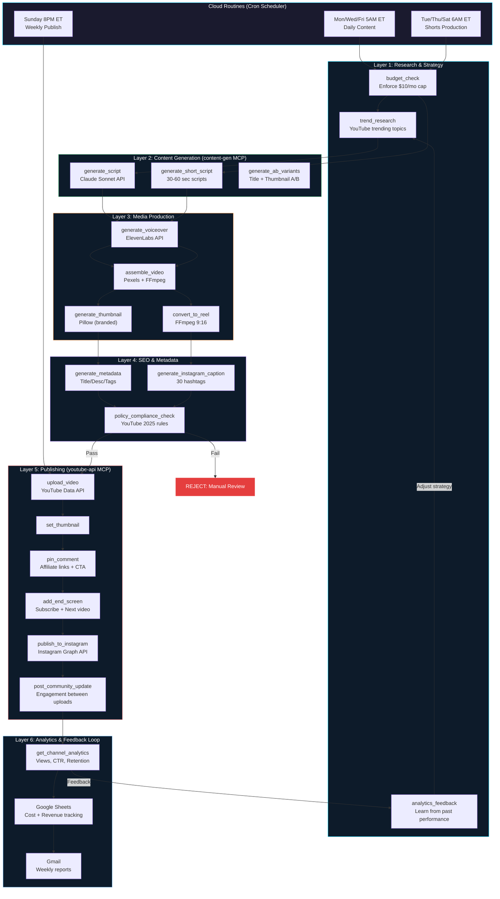
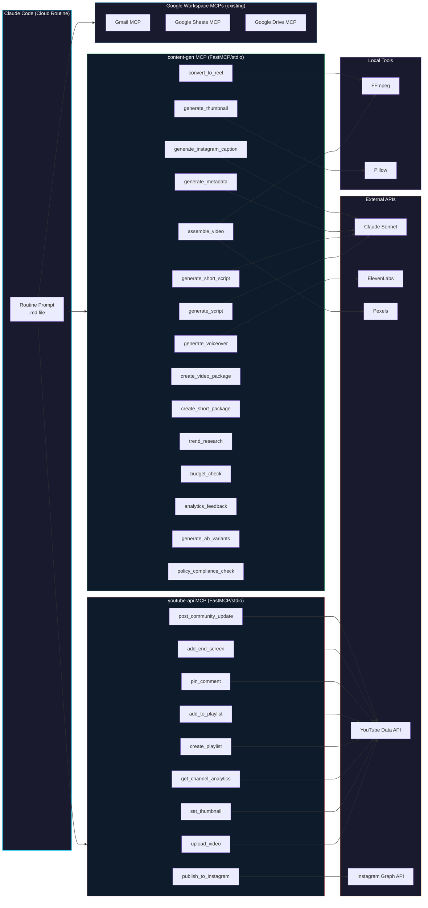
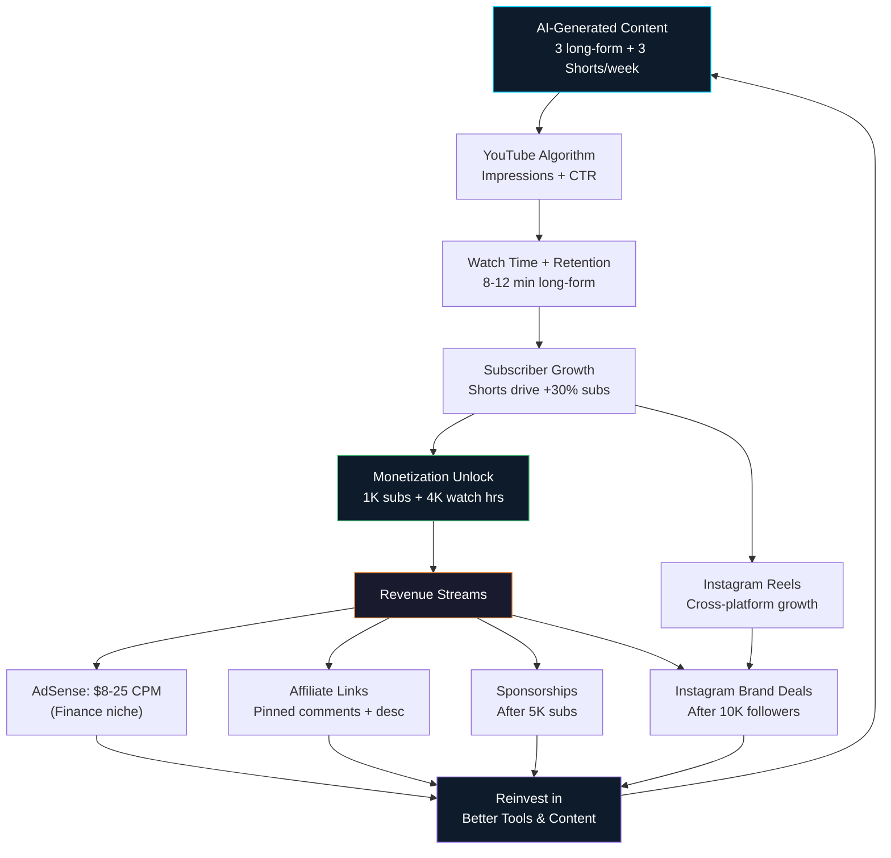

# Shark Content Factory

Fully automated multi-platform content pipeline for **SharkWave AI** — YouTube long-form, YouTube Shorts, and Instagram Reels. Researches topics, writes scripts, generates voiceovers, assembles videos, creates thumbnails, and publishes on schedule.

**Cost to run: ~$6.60/month. Projected revenue: $200-3,000/month at scale.**

---

## System Design (Mermaid Diagrams)

### End-to-End Pipeline Flow



### MCP Server Architecture



### Revenue Flywheel



---

## YouTube 2025 Policy Compliance

**Critical**: YouTube's July 2025 policy update bans "Inauthentic Content." Our factory includes a `policy_compliance_check` tool that validates every video before publishing.

### Pre-Publish Checklist (automated)

- [ ] **Original Commentary** — Script includes original analysis, not just reading others' work
- [ ] **Unique Value** — Each video provides insights not found in other videos
- [ ] **AI Disclosure** — `containsSyntheticMedia: true` set on every upload
- [ ] **No Duplicate Content** — Script is meaningfully different from previous episodes
- [ ] **Not "Mass-Produced"** — Max 3 long-form + 3 Shorts per week (well under spam threshold)
- [ ] **Proper Disclaimers** — "Not financial advice" included in every script + description
- [ ] **No Deepfakes** — No realistic AI clones of real people's faces or voices
- [ ] **Brand Identity** — Consistent SharkWave AI branding across all content

### Why Our Approach Is Safe

1. **Niche expertise** — Content is about our own trading agent (`shark-trading-agent` repo)
2. **Original data** — Build logs use real trading performance data
3. **Educational value** — Tutorials teach genuine skills
4. **Transparent** — AI-generated label on every video
5. **Low volume** — 3 videos/week is far below spam threshold

---

## Infrastructure Design

### How It Works: Two Runtime Modes

```
┌─────────────────────────────────────────────────────────────────────────┐
│                     PRODUCTION (Cloud Routines)                        │
│                                                                         │
│  Anthropic Cloud Infrastructure — runs on CRON, no laptop needed       │
│                                                                         │
│  ┌──────────────────┐    ┌─────────────────────────────────────────┐   │
│  │  Cron Scheduler   │    │  Cloud Container (per routine run)      │   │
│  │                    │    │                                         │   │
│  │  Mon-Fri 5AM ET   │───►│  1. Reads CLAUDE.md (persona/rules)    │   │
│  │  Tue/Thu/Sat 6AM  │    │  2. Reads routine prompt (.md file)     │   │
│  │  Sunday 8PM ET    │    │  3. Calls MCP tools (subprocess/stdio)  │   │
│  └──────────────────┘    │  4. MCP tools call external APIs         │   │
│                           │  5. Writes output to content/ dir        │   │
│                           │  6. Commits changes back to git repo     │   │
│                           └──────────┬──────────────────────────────┘   │
│                                      │                                  │
│                                      ▼                                  │
│                           ┌──────────────────────┐                     │
│                           │  MCP Servers (stdio)  │                     │
│                           │                        │                     │
│                           │  content-gen.py ───────┼──► Claude API      │
│                           │    └─ generate_script  │    ElevenLabs API  │
│                           │    └─ generate_voice   │    Pexels API      │
│                           │    └─ assemble_video   │    FFmpeg (local)  │
│                           │    └─ gen_thumbnail    │    Pillow (local)  │
│                           │    └─ create_short     │                     │
│                           │                        │                     │
│                           │  youtube-api.py ───────┼──► YouTube API     │
│                           │    └─ upload_video     │    Instagram API   │
│                           │    └─ set_thumbnail    │                     │
│                           │    └─ analytics        │                     │
│                           └──────────────────────┘                     │
│                                      │                                  │
│                                      ▼                                  │
│                           ┌──────────────────────┐                     │
│                           │  Google Workspace MCPs │ (existing, config) │
│                           │  Gmail ──► email notif │                     │
│                           │  Sheets ──► cost logs  │                     │
│                           │  Drive ──► reports     │                     │
│                           └──────────────────────┘                     │
└─────────────────────────────────────────────────────────────────────────┘

┌─────────────────────────────────────────────────────────────────────────┐
│                   LOCAL DEVELOPMENT (Your MacBook)                      │
│                                                                         │
│  Same code, same MCP servers — but YOU trigger it manually             │
│                                                                         │
│  VS Code + Claude Code Extension                                       │
│    └── Paste a routine prompt into Claude Code                         │
│    └── MCP servers run as local subprocesses (stdio)                   │
│    └── FFmpeg + Chromium + Python all execute on your Mac              │
│    └── Good for: testing, debugging, one-off video generation          │
│    └── Bad for: production (laptop must be open + running)             │
└─────────────────────────────────────────────────────────────────────────┘
```

### What Runs Where

| Component | Local Dev (MacBook) | Production (Cloud Routines) |
|-----------|--------------------|-----------------------------|
| **Claude Code** | VS Code extension | Cloud container |
| **MCP Servers** | Subprocess on Mac (stdio) | Subprocess in container (stdio) |
| **Cron Scheduling** | Manual trigger | Automatic cron |
| **FFmpeg** | `brew install ffmpeg` | Pre-installed in container |
| **Python + Pillow** | Local Python 3.12 | Container Python runtime |
| **API Calls** | From your Mac's IP | From Anthropic cloud IP |
| **Git Repo Access** | Local clone | Container has repo access |
| **File Output** | `content/` directory | Committed back to git |
| **Secrets/Keys** | `.env` file | Cloud Routine env vars |

### Cloud Routines — How It Actually Works

1. **You configure** a Cloud Routine in the Anthropic dashboard
2. **You set a cron schedule** (e.g., `0 5 * * 1-5` for Mon-Fri at 5 AM ET)
3. **You point it** at this git repo + a routine prompt file (e.g., `routines/daily_content.md`)
4. **At the scheduled time**, Anthropic spins up a cloud container:
   - Clones this repo
   - Reads `CLAUDE.md` for persona/rules
   - Reads the routine prompt for instructions
   - Starts MCP servers as subprocesses (from `.claude/mcp.json`)
   - Claude follows the routine prompt step-by-step
   - Calls MCP tools to generate content / upload / send emails
   - Commits any new files back to the repo
5. **Container shuts down** after the routine completes
6. **Your laptop is OFF** — everything runs in the cloud

### MCP Server Architecture

```
.claude/mcp.json defines which MCP servers are available:

┌──────────────────────────────────────────────────────────────┐
│  CUSTOM MCP SERVERS (we built these)                         │
│                                                              │
│  content-gen.py (FastMCP, stdio transport)                   │
│  ├── generate_script ──────► Claude Sonnet API               │
│  ├── generate_short_script ► Claude Sonnet API               │
│  ├── generate_voiceover ───► ElevenLabs API                  │
│  ├── assemble_video ───────► Pexels API + FFmpeg             │
│  ├── generate_thumbnail ──► Pillow                           │
│  ├── generate_metadata ───► Claude Sonnet API                │
│  ├── generate_instagram_caption ► Claude Sonnet API          │
│  ├── convert_to_reel ─────► FFmpeg                           │
│  ├── create_video_package ► Orchestrator (long-form)         │
│  └── create_short_package ► Orchestrator (Shorts + Reels)    │
│                                                              │
│  youtube-api.py (FastMCP, stdio transport)                   │
│  ├── upload_video ────────► YouTube Data API v3              │
│  ├── set_thumbnail ───────► YouTube Data API v3              │
│  ├── get_channel_analytics ► YouTube Data API v3             │
│  ├── create_playlist ─────► YouTube Data API v3              │
│  ├── add_to_playlist ─────► YouTube Data API v3              │
│  └── publish_to_instagram ► Instagram Graph API              │
├──────────────────────────────────────────────────────────────┤
│  EXISTING MCP SERVERS (configure, don't build)               │
│                                                              │
│  Gmail MCP ──────► Send email notifications (replaces SendGrid) │
│  Google Sheets MCP ► Cost tracking + publish logs (replaces CSV) │
│  Google Drive MCP ► Weekly reports as Google Docs             │
│  Playwright MCP ──► Browser research (YouTube trend scraping) │
└──────────────────────────────────────────────────────────────┘
```

---

## Setup Checklist

### Phase 1: API Keys & Accounts (do this first)

- [ ] **1.1 Anthropic API Key**
  - Go to: <https://console.anthropic.com/settings/keys>
  - Create a new API key
  - Save as `ANTHROPIC_API_KEY` in `.env`
  - Used for: script generation + metadata (~$0.60/month)

- [ ] **1.2 ElevenLabs API Key**
  - Go to: <https://elevenlabs.io/>
  - Sign up for Starter plan ($6/month)
  - Go to Profile > API Key
  - Save as `ELEVENLABS_API_KEY` in `.env`
  - Used for: voiceover generation (30K chars/month)

- [ ] **1.3 Pexels API Key**
  - Go to: <https://www.pexels.com/api/new/>
  - Create a free account and get API key
  - Save as `PEXELS_API_KEY` in `.env`
  - Used for: stock video footage (FREE, unlimited)

### Phase 2: Google Cloud Console (one-time)

- [ ] **2.1 Create Google Cloud Project**
  - Go to: <https://console.cloud.google.com/>
  - Create a new project: "Shark Content Factory"

- [ ] **2.2 Enable APIs** (in the project):
  - [ ] YouTube Data API v3
  - [ ] Gmail API
  - [ ] Google Sheets API
  - [ ] Google Drive API

- [ ] **2.3 Create OAuth 2.0 Credentials**
  - Go to: APIs & Services > Credentials
  - Click: Create Credentials > OAuth 2.0 Client ID
  - Application type: **Desktop app**
  - Name: "Shark Content Factory"
  - Download the JSON file

- [ ] **2.4 Save OAuth Credentials**
  - Create directory: `mkdir -p ~/.shark-content-factory`
  - Save downloaded JSON as: `~/.shark-content-factory/client_secrets.json`

- [ ] **2.5 Run OAuth Setup (on personal laptop)**
  ```bash
  python oauth_setup.py
  ```
  - This opens a browser, you authorize the app
  - Token saved to: `~/.shark-content-factory/youtube_token.json`
  - Authorizes: YouTube + Gmail + Sheets + Drive in one flow

### Phase 3: Instagram Setup (optional, for Reels)

- [ ] **3.1 Instagram Business/Creator Account**
  - Convert your Instagram account to Business or Creator type
  - Connect it to a Facebook Page

- [ ] **3.2 Meta Developer App**
  - Go to: <https://developers.facebook.com/>
  - Create a new app (Business type)
  - Add Instagram Graph API product
  - Generate a long-lived access token
  - Save as `INSTAGRAM_ACCESS_TOKEN` in `.env`

- [ ] **3.3 Get Business Account ID**
  - Use the Graph API Explorer to query your account ID
  - Save as `INSTAGRAM_BUSINESS_ACCOUNT_ID` in `.env`
  - Note: Instagram Reels can also be uploaded manually from `content/reels/`

### Phase 4: Google Sheets Setup (cost tracking)

- [ ] **4.1 Create Tracking Spreadsheet**
  - Create a new Google Sheet named "Shark Content Factory — Costs & Analytics"
  - Create tabs: "Daily Costs", "Weekly Reports", "Analytics"
  - Copy the spreadsheet ID from the URL
  - Save as `GOOGLE_SHEETS_SPREADSHEET_ID` in `.env`

- [ ] **4.2 Daily Costs Tab — Column Headers**
  ```
  Date | Topic | Series | Script Cost | Voice Chars | Voice Cost | Total Cost | Monthly Running Total
  ```

- [ ] **4.3 Weekly Reports Tab — Column Headers**
  ```
  Week | Videos Published | Shorts Published | Total Cost | Subscribers | Total Views | Top Video
  ```

### Phase 5: Local Development Setup (your personal MacBook)

- [ ] **5.1 Install Prerequisites**
  ```bash
  brew install ffmpeg python@3.12
  ```

- [ ] **5.2 Clone and Install**
  ```bash
  git clone https://github.com/saijayanth888/shark-content-factory.git
  cd shark-content-factory
  pip install -r requirements.txt
  ```

- [ ] **5.3 Configure Environment**
  ```bash
  cp .env.template .env
  # Fill in all API keys from Phase 1-4
  ```

- [ ] **5.4 Run OAuth Setup**
  ```bash
  python oauth_setup.py
  # Authorize in browser → token saved
  ```

- [ ] **5.5 Run Unit Tests**
  ```bash
  pytest                    # unit tests (no API keys needed)
  pytest -m integration     # integration tests (needs keys)
  ```

- [ ] **5.6 Test a Single Video Package (manual)**
  ```
  Open Claude Code in VS Code
  Paste the daily_content.md routine prompt
  Watch it generate a full video package
  ```

### Phase 6: Production Deployment (Cloud Routines)

- [ ] **6.1 Push Repo to GitHub**
  ```bash
  git add -A
  git commit -m "Shark Content Factory — initial build"
  git push origin main
  ```

- [ ] **6.2 Configure Cloud Routine Environment Variables**
  In the Anthropic Cloud Routines dashboard, set these env vars:
  ```
  ANTHROPIC_API_KEY=sk-ant-...
  ELEVENLABS_API_KEY=xi-...
  PEXELS_API_KEY=...
  YOUTUBE_CLIENT_SECRETS_PATH=/path/in/container/client_secrets.json
  YOUTUBE_TOKEN_PATH=/path/in/container/youtube_token.json
  INSTAGRAM_ACCESS_TOKEN=... (optional)
  INSTAGRAM_BUSINESS_ACCOUNT_ID=... (optional)
  GOOGLE_SHEETS_SPREADSHEET_ID=...
  MONTHLY_BUDGET_CAP_USD=10.00
  ```

- [ ] **6.3 Upload OAuth Token to Cloud Routines**
  - The `youtube_token.json` from Phase 2.5 must be accessible in the container
  - Upload via Cloud Routines secrets/file configuration

- [ ] **6.4 Create Cloud Routine: Daily Content Production**
  ```
  Name:     shark-daily-content
  Repo:     github.com/saijayanth888/shark-content-factory
  Prompt:   routines/daily_content.md
  Schedule: 0 9 * * 1,3,5        (Mon/Wed/Fri at 9 AM UTC = 5 AM ET)
  MCP:      .claude/mcp.json
  ```

- [ ] **6.5 Create Cloud Routine: Shorts & Reels Production**
  ```
  Name:     shark-shorts-production
  Repo:     github.com/saijayanth888/shark-content-factory
  Prompt:   routines/shorts_production.md
  Schedule: 0 10 * * 2,4,6       (Tue/Thu/Sat at 10 AM UTC = 6 AM ET)
  MCP:      .claude/mcp.json
  ```

- [ ] **6.6 Create Cloud Routine: Weekly Batch Publish**
  ```
  Name:     shark-weekly-publish
  Repo:     github.com/saijayanth888/shark-content-factory
  Prompt:   routines/weekly_publish.md
  Schedule: 0 0 * * 1             (Monday at 12 AM UTC = Sunday 8 PM ET)
  MCP:      .claude/mcp.json
  ```

- [ ] **6.7 Verify First Run**
  - Watch the first routine execution in the Cloud Routines dashboard
  - Check: did it generate a script? Download footage? Create video?
  - Check: did it commit the manifest to the repo?
  - Check: did it log costs to Google Sheets?
  - Check: did it send a notification email via Gmail?

### Phase 7: Ongoing Monitoring

- [ ] **7.1 Weekly Check: Google Sheets**
  - Review cost tracking — are we under $10/month?
  - Review analytics — which videos perform best?

- [ ] **7.2 Monthly Check: ElevenLabs Usage**
  - 30K characters/month limit on Starter plan
  - ~7,500 chars per long-form video → ~4 long-form/month max
  - Shorts use ~500 chars each → minimal impact

- [ ] **7.3 Monthly Check: YouTube Studio**
  - Review analytics, audience retention, CTR
  - Adjust content strategy based on performance

---

## Content Strategy

| Day | Time (ET) | Content | Platforms |
|-----|-----------|---------|-----------|
| Monday | 10:00 AM | Tool Teardown (long-form 8-12 min) | YouTube |
| Tuesday | 12:00 PM | Short (30-60 sec) + Reel | YouTube Shorts + Instagram |
| Wednesday | 10:00 AM | Build With AI (long-form 8-12 min) | YouTube |
| Thursday | 12:00 PM | Short (30-60 sec) + Reel | YouTube Shorts + Instagram |
| Friday | 10:00 AM | Shark Agent Build Log (long-form 8-12 min) | YouTube |
| Saturday | 12:00 PM | Best-of-week Short + Reel | YouTube Shorts + Instagram |

**Weekly output: 3 long-form + 3 Shorts + 3 Reels = 9 pieces of content/week**

---

## Revenue Projections

### Revenue Streams

| Stream | When Available | Monthly Estimate |
|--------|---------------|-----------------|
| YouTube AdSense | After 1K subs + 4K watch hrs | $120-1,200 |
| YouTube Shorts RPM | After monetization | $5-50 |
| Affiliate Revenue | Day 1 (Alpaca, broker referrals, tools) | $50-500 |
| Sponsorships | After 5K subscribers | $500-2,000/video |
| Instagram Brand Deals | After 10K followers | $100-500 |

### Growth Timeline

| Phase | Timeline | Subs | Monthly Views | Revenue | Cost | Net |
|-------|----------|------|---------------|---------|------|-----|
| **Launch** | Month 1-3 | 0-500 | 1K-5K | $0 | ~$7 | -$7/mo |
| **Growth** | Month 4-6 | 500-1.5K | 5K-20K | $0-100 | ~$7 | -$7 to +$93 |
| **Monetize** | Month 7-12 | 1.5K-5K | 20K-50K | $200-800 | ~$7 | +$193-793 |
| **Scale** | Month 13-24 | 5K-20K | 50K-200K | $800-3,000 | ~$7 | +$793-2,993 |

### Finance Niche CPM Advantage

The AI/Finance niche has some of the **highest CPMs on YouTube**:
- General YouTube average: $3-5 CPM
- Finance/Trading niche: **$8-25 CPM**
- AI/Tech niche: **$6-15 CPM**
- AI + Finance overlap (our niche): **$10-25 CPM**

At 50K views/month with $12 CPM: **$600/month from AdSense alone.**

### Multi-Platform Revenue Math

```
YouTube Long-form (3/week):
  12 videos/month x 3K avg views = 36K views x $12 CPM = $432/month

YouTube Shorts (3/week):
  12 shorts/month x 10K avg views = 120K views x $0.05 RPM = $6/month
  Shorts drive 20-30% more subs = faster monetization

Instagram Reels (3/week):
  12 reels/month builds separate audience for brand deals at 10K followers
  Cross-promotes YouTube with 10-20% view boost on long-form

Affiliate Revenue:
  Alpaca referral: $50-200/month
  Tool affiliate links: $50-300/month

Projected totals:
  At 6 months:  $100-500/month
  At 12 months: $500-1,500/month
  At 24 months: $1,500-5,000/month
```

---

## Monthly Costs

| Item | Cost | Notes |
|------|------|-------|
| ElevenLabs Starter | $6.00 | 30K chars/month (~4 long-form + shorts) |
| Claude Sonnet API | ~$0.60 | ~6 script generations + metadata |
| Pexels API | FREE | Stock video footage |
| FFmpeg | FREE | Video assembly |
| Pillow | FREE | Thumbnail generation |
| YouTube Data API | FREE | Upload + analytics |
| Instagram Graph API | FREE | Reel publishing |
| **Total** | **~$6.60/month** | **Under $10 budget cap** |

---

## Directory Structure

```
shark-content-factory/
├── CLAUDE.md                     # AI persona, content strategy, revenue model
├── README.md                     # This file — design, infra, checklist
├── requirements.txt              # Python dependencies
├── .env.template                 # Environment variable template
├── .gitignore
├── oauth_setup.py                # One-time Google OAuth setup
├── pytest.ini                    # Test config (skips integration by default)
│
├── .claude/
│   └── mcp.json                  # MCP server config (used by Cloud Routines)
│
├── mcp_servers/                  # Custom FastMCP servers
│   ├── __init__.py
│   ├── content_gen.py            # 15 tools: script/voice/video/thumb/meta/shorts/reels/budget/trends/ab/policy
│   └── youtube_api.py            # 9 tools: upload/thumbnail/analytics/playlists/instagram/comment/endscreen/community
│
├── routines/                     # Cloud Routine prompts (cron-triggered)
│   ├── daily_content.md          # Mon/Wed/Fri — long-form video production
│   ├── shorts_production.md      # Tue/Thu/Sat — Shorts + Reels production
│   └── weekly_publish.md         # Sunday — batch upload + analytics + report
│
├── config/
│   ├── voices.json               # ElevenLabs voice settings
│   ├── niches.json               # Topic keywords + competitors
│   ├── schedule.json             # Publish schedule + cron expressions
│   └── platforms.json            # Platform specs (YT/Shorts/IG resolution, codecs)
│
├── templates/
│   ├── script_trading_update.txt # Build Log script template
│   ├── script_tool_review.txt    # Tool Teardown script template
│   ├── script_tutorial.txt       # Build With AI script template
│   └── script_short.txt          # Shorts/Reels script template
│
├── content/
│   ├── queue/                    # Long-form videos ready to publish
│   ├── published/                # Published manifests (archived)
│   ├── footage/                  # Pexels clips (cached, gitignored)
│   ├── shorts/                   # YouTube Shorts queue
│   └── reels/                    # Instagram Reels queue + captions
│
└── tests/
    ├── __init__.py
    ├── test_content_gen.py       # Unit + integration tests for content pipeline
    └── test_youtube_api.py       # Unit + integration tests for publishing
```

---

## MCP Tools Reference

### content-gen MCP Server (15 tools)

| Tool | Description | External API |
|------|-------------|-------------|
| `generate_script` | 8-12 min video script with retention hooks | Claude Sonnet |
| `generate_short_script` | 30-60 sec Shorts/Reels script | Claude Sonnet |
| `generate_voiceover` | Text-to-speech audio | ElevenLabs |
| `assemble_video` | Video assembly (16:9 or 9:16) | Pexels + FFmpeg |
| `generate_thumbnail` | 1280x720 branded thumbnail (Linux-safe fonts) | Pillow (local) |
| `generate_metadata` | SEO title, description, tags | Claude Sonnet |
| `generate_instagram_caption` | Caption + 30 hashtags | Claude Sonnet |
| `convert_to_reel` | Re-encode Short for Instagram | FFmpeg (local) |
| `create_video_package` | **Full pipeline** (long-form) | All above |
| `create_short_package` | **Full pipeline** (Short + Reel) | All above |
| `budget_check` | **Budget guard** — enforce $10/mo cap | Local (manifest scan) |
| `trend_research` | **Trend research** — YouTube autocomplete + niche scoring | YouTube Suggest API |
| `analytics_feedback` | **Analytics loop** — learn from past performance | Local (manifest analysis) |
| `generate_ab_variants` | **A/B testing** — 3 title + 2 thumbnail variants | Claude Sonnet + Pillow |
| `policy_compliance_check` | **Policy gate** — YouTube 2025 rules validation | Local (script analysis) |

### youtube-api MCP Server (9 tools)

| Tool | Description | External API |
|------|-------------|-------------|
| `upload_video` | Upload long-form or Shorts | YouTube Data API v3 |
| `set_thumbnail` | Custom thumbnail upload | YouTube Data API v3 |
| `get_channel_analytics` | Subs, views, recent video stats | YouTube Data API v3 |
| `create_playlist` | Create series playlist | YouTube Data API v3 |
| `add_to_playlist` | Add video to playlist | YouTube Data API v3 |
| `pin_comment` | **Post channel comment** (affiliate links + CTA) | YouTube Data API v3 |
| `add_end_screen` | **End screen config** (subscribe + next video) | YouTube Studio (instructions) |
| `post_community_update` | **Community post** (polls, announcements) | YouTube Studio (instructions) |
| `publish_to_instagram` | Publish Reel to Instagram | Instagram Graph API |

---

## License

MIT
